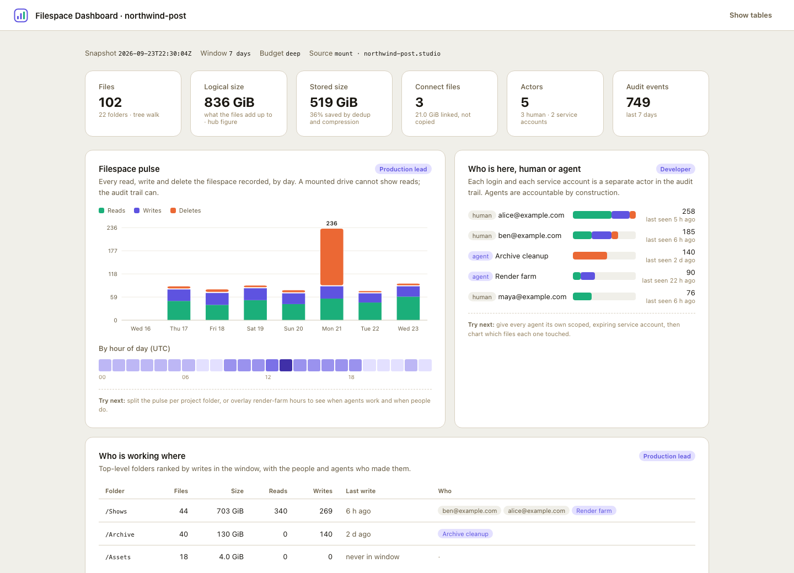

# Filespace dashboard

An agent **skill** that builds a shareable dashboard for a
[LucidLink](https://www.lucidlink.com) filespace and places it inside the
filespace, so everyone with the drive mounted sees the same page. One
self-contained `index.html`, rendered from the filespace's audit trail and
directory tree - no server, no build step, no external calls.

It ships in LucidLink's `lucidlink` plugin; the [repository README](../../README.md)
has the install for Claude Code and Codex, both tested. This folder on its own
is a plain [Agent Skills](https://agentskills.io) package.

Ask your agent things like:

- *"Build a dashboard for the production filespace."*
- *"Who touched what in /Shows this week?"*
- *"Which files over 1 GB haven't changed in six months?"*



## What you get

Tiles, each tagged with the persona it serves. The interesting ones are those
a plain file listing cannot give: every read and write with its actor, and
service accounts (agents) as first-class actors.

| Tile | Persona | What only LucidLink can show here |
|---|---|---|
| Filespace pulse | Production lead | reads as well as writes, per day, with an hourly profile |
| Who is here, human or agent | Developer | service accounts as separate, accountable actors |
| Who is working where | Production lead | writers per folder from the audit trail |
| Cold and hot | Storage admin | bytes on the age curve, archive candidates |
| What the bytes are | Storage admin | size by type, stored versus logical size |
| What just changed | Production lead | newest writes, moves, deletes with actor, save fan-out collapsed |
| Flags | Storage admin | delete bursts, silent agents, single-actor windows |

## What's in this skill

```
filespace-dashboard/
├── SKILL.md                  # the skill: interview, procedure, guardrails
├── config.example.yaml       # every option, commented
├── scripts/
│   ├── snapshot.py           # collector: mount or sdk source, three budgets
│   └── render.py             # embeds snapshot.json into the template, publishes, keeps history
├── templates/dashboard.html  # the page: dependency-free charts, works from file://
├── references/               # mcp-recipe, snapshot-schema, tile-catalog, customizing, limits
└── examples/demo/            # a synthetic snapshot and screenshot; render it to see the page
```

## Quickstart

**You need:** a filespace with the **audit trail enabled** (a filespace admin
turns it on; only events after that point are recorded), and one of: the
filespace mounted on your machine, the
[LucidLink MCP server](https://pypi.org/project/lucidlink-mcp/) in your agent,
or Python 3.10+ with the [LucidLink SDK](https://pypi.org/project/lucidlink/)
and a service-account token.

1. **Install** the `lucidlink` plugin (Claude Code) or clone the skills
   folder (Codex): see the [repository README](../../README.md).

2. **Ask for a dashboard:**

   > Build a dashboard for my filespace.

   The description triggers it. To call it by name: Claude Code
   `/lucidlink:filespace-dashboard`, Codex `$lucidlink:filespace-dashboard`.

   The skill confirms which filespace, who reads the page first, which folders
   matter, how much to spend, and where to put it (default
   `/Dashboards/<filespace>/` inside the filespace). Then it collects, renders,
   and tells you where the page is, with the three most notable findings and
   the limits of the snapshot.

3. **Open it from the drive:** `/Dashboards/<filespace>/index.html` in any
   browser. Refresh by asking again, or schedule the two scripts below and
   spend no agent tokens at all.

## Run the scripts yourself

No agent needed. Python 3.10 or newer; standard library only for a mounted
filespace (`pyyaml` if you prefer a YAML config). The commands run from this
folder, `skills/filespace-dashboard`.

```bash
cp config.example.yaml config.yaml          # in your working folder; set filespace.root, output.dir, output.publish_to (absolute paths)
python3 scripts/snapshot.py --config config.yaml
python3 scripts/render.py --snapshot out/snapshot.json --publish "/Volumes/<workspace>/<filespace>/Dashboards/<name>"
```

A mount cannot see the stored size (after deduplication and compression) or
Connect-linked files. Pass them from the MCP server's `filespace_stats` tool,
as a JSON string or a file:

```bash
python3 scripts/snapshot.py --config config.yaml --stats '{"data_bytes": N, "storage_bytes": N, "external_files": N, "external_bytes": N}'
```

Schedule those lines with cron, launchd or Task Scheduler and the dashboard
refreshes on its own. `--publish` keeps a dated copy of every snapshot under
`history/` for trends.

## Sources

| `filespace.source` | Needs | Stored size | Notes |
|---|---|---|---|
| `mount` | the filespace mounted locally | via `--stats` | fastest; reads metadata and `/.lucid_audit` only |
| `sdk` | `pip install lucidlink` and a service-account token in `$LUCIDLINK_TOKEN` | yes | several times slower than a mount and keeps a local cache of about 1 GB; the page stays local (there is no mount to publish into) |
| `mcp` | the LucidLink MCP server in your agent | yes | the agent builds `snapshot.json` by hand following `references/mcp-recipe.md`; 15 to 200 calls by budget and filespace size |

## Budgets

| Budget | Walk | Audit window | Extras | Rough MCP cost |
|---|---|---|---|---|
| `lite` | 3,000 entries or 30 s | 7 days | none | about 5 calls |
| `standard` | 40,000 entries or 2 min | 7 days | hourly profile, flags | 20 to 40 calls |
| `deep` | 400,000 entries or 15 min | 30 days | everything | 100 or more |

`deep` is the default on a mount or the SDK, where the budget only bounds
time. `standard` is the default on the mcp source, where it is a call count;
it samples any filespace above 40,000 entries, and the header says so.

## Limits, stated plainly

- The audit trail must be enabled by a filespace admin. Only events after that point exist, and a login whose role cannot read the trail sees none of it.
- A snapshot is a point in time. Refresh by rerunning or by scheduling the scripts.
- Large filespaces are sampled once the walk budget is hit. The header marks walked figures and says "sample"; details under Flags.
- One save in a desktop app can produce several audit rows. The ticker collapses them per second; the pulse counts raw rows.
- Actor names are personal data. The page lives inside the filespace by default; copy it elsewhere deliberately.
- There is no hosted URL for filespace content. Open the page from the mounted drive, or serve the folder locally.
- Sizes on the page are binary units (GiB), the same convention as `filespace_stats`.

## Troubleshooting

| Symptom | Fix |
|---|---|
| Activity tiles are empty | The audit trail is off, or this login's role cannot read it. Check with an admin login or the MCP `get_audit_trail_status_admin` tool. |
| Stored size and Connect files say `n/a` | A mount cannot see them. Pass `--stats` from the MCP `filespace_stats` tool, or use the `sdk` source. |
| Header says "sample" | The walk hit its budget. Rerun with `--budget deep`. |
| `sdk` source: "workspace … is not visible to this token" | Service-account tokens are scoped to one workspace. Use `<filespace>.<workspace>` or just the filespace name in `filespace.name`, and check `$LUCIDLINK_TOKEN`. |
| The page shows "This dashboard draws its tiles with JavaScript" | The viewer did not run scripts (Quick Look, chat previews). Open `index.html` in a browser. |
| Browser tooling refuses `file://` | Serve the folder: `python3 -m http.server 8765 --directory out`, then open `http://127.0.0.1:8765/index.html`. |
| `root is not a directory`, or only empty `<filespace>-2` folders under `/Volumes/<workspace>/` | The filespace is not mounted; those are stale mount points. `mount \| grep <filespace>` shows live mounts. Mount it, or use the `sdk` or `mcp` source. |
| MCP: `filespace_stats` names another filespace | The MCP server's current filespace is shared by every session using it. `link_filespace` again, then `current_filespace`, then the scoped calls. |
| MCP: a result ends with `output truncated at 131072 bytes` | Lower `limit` to 500 or below and split by time or folder; drop the cut last line. |
| MCP: `get_audit_trail_status_admin` returns 404 | It runs as the current account and needs the `filespace_id` printed by `link_filespace`; link the filespace first. |
| Codex: `--publish` fails with `PermissionError: [Errno 1] Operation not permitted` | The target is outside Codex's workspace sandbox. Start Codex with `--add-dir <that folder>`; `index.html` beside the snapshot is still written. |

## Links

- [LucidLink AI](https://github.com/LucidLink/lucidlink-ai) - all LucidLink AI integrations
- [LucidLink MCP server on PyPI](https://pypi.org/project/lucidlink-mcp/)
- [LucidLink Python SDK on PyPI](https://pypi.org/project/lucidlink/)
- [LucidLink Developer Portal](https://developer.lucidlink.com/)
- [LucidLink Support](https://support.lucidlink.com/)
